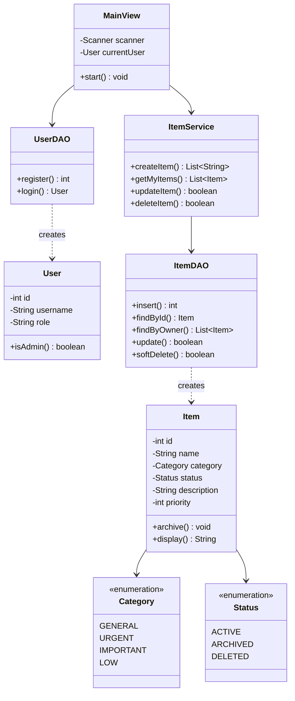
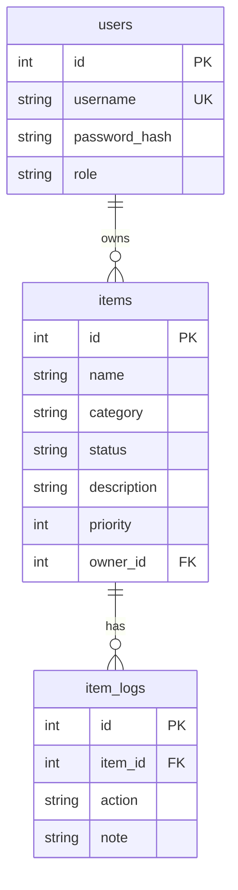

# 📋 期末專題模板

> 把這裡換成你的專題名稱和簡介

## 🏗️ 專案架構

```
project-template/
├── src/main/java/com/template/
│   ├── Main.java                    ← 程式入口
│   ├── config/
│   │   └── DatabaseConfig.java      ← JDBC 連線設定
│   ├── model/
│   │   ├── enums/
│   │   │   ├── Category.java        ← 類別列舉（請改成你的分類）
│   │   │   └── Status.java          ← 狀態列舉（請改成你的狀態流程）
│   │   ├── User.java                ← 使用者（可直接沿用）
│   │   └── Item.java                ← 核心物件（請改名+改屬性）
│   ├── dao/
│   │   ├── UserDAO.java             ← 使用者 CRUD（可直接沿用）
│   │   └── ItemDAO.java             ← 核心物件 CRUD（請改 SQL）
│   ├── service/
│   │   └── ItemService.java         ← 業務邏輯（驗證、權限）
│   └── view/
│       └── MainView.java            ← CLI 選單（請改選單文字）
├── sql/
│   └── schema.sql                   ← 建表 + 種子資料（請改表格）
├── run.sh                           ← Mac/Linux 一鍵執行
└── run.bat                          ← Windows 一鍵執行
```

## 🚀 如何使用

### 1. 建立資料庫

```bash
# 建立 PostgreSQL 資料庫（Docker 方式）
docker run -d --name mydb -p 5432:5432 \
  -e POSTGRES_PASSWORD=postgres \
  -e POSTGRES_DB=myproject \
  postgres:16

# 匯入資料表
psql -U postgres -h localhost -d myproject -f sql/schema.sql
```

### 2. 編譯 & 執行

```bash
chmod +x run.sh
./run.sh
```

### 3. 測試帳號

| 帳號 | 密碼 | 角色 |
|------|------|------|
| admin | admin | 管理者 |
| demo | demo | 一般使用者 |

## 📐 架構說明

```
View（畫面）  →  Service（邏輯）  →  DAO（資料庫）  →  PostgreSQL
  ↑ Scanner         ↑ 驗證/判斷         ↑ SQL/JDBC
  ↓ println         ↓ 回傳結果         ↓ 回傳 Model
```

### 各層職責

| 層 | 職責 | 可以做 | 不能做 |
|----|------|--------|--------|
| **View** | 使用者互動 | Scanner / println / 選單 | 寫 SQL |
| **Service** | 業務邏輯 | 驗證 / 計算 / 呼叫 DAO | 碰 Scanner |
| **DAO** | 資料存取 | SQL / JDBC / 回傳 Model | 業務判斷 |
| **Model** | 資料結構 | 屬性 / Getter / 業務方法 | 碰資料庫 |

## 📝 修改步驟（同學照做）

1. **改 package 名稱**：把 `com.template` 改成 `com.你的專題`
2. **改 Enum**：`Category` → 你的分類、`Status` → 你的狀態流程
3. **改 Model**：`Item` → 你的核心物件（例如 `Rose`、`Room`、`Bill`）
4. **改 SQL**：`schema.sql` 裡的 `items` 表改成你的資料表
5. **改 DAO**：`ItemDAO` 的 SQL 和 `mapRow()` 對應新欄位
6. **改 Service**：驗證規則改成你的業務需求
7. **改 View**：選單文字和操作流程

## 📊 類別圖（Mermaid）



## 📊 ERD（Mermaid）


