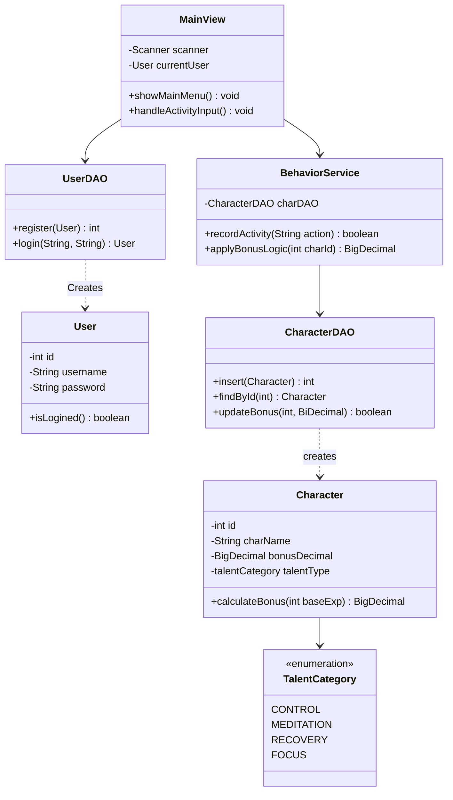
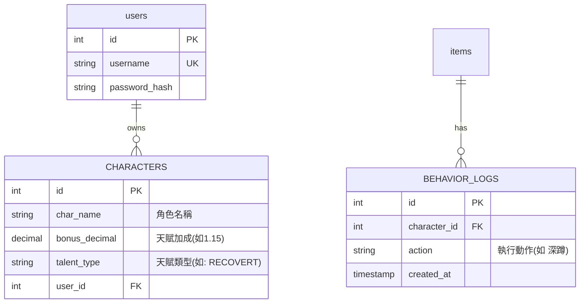
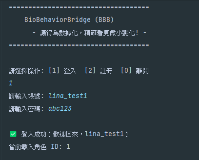
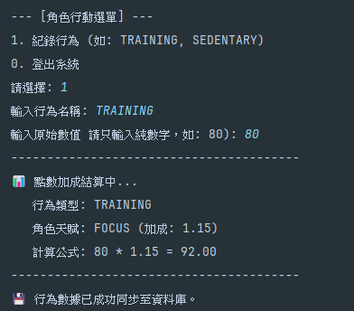

# BioBehaviorBridge (BBB)

## 📌 專案簡介
這是一個專為行為追蹤與生理數據量化設計的 Java 系統。
專案核心在於建立「行為」與「目標」之間的科學連結，特別針對戒斷恢復期設計。
透過自定義的角色天賦倍率（例如 1.15），將抽象的日常行為（冥想、重訓、飲食控制）轉化為具體的成長數據。

## 📊 技術架構 (ERD)

```text
BioBehaviorBridge/
├── sql/
│   └── schema.sql             # 資料庫建表與初始資料 (包含目標、天賦倍率設定)
├── src/
│   └── com/linalingling/bbb/   # 原始碼根目錄 (Sources Root)
│       ├── Main.java          # 程式進入點 (負責整合測試與執行流)
│       ├── config/            # 系統配置
│       │   └── DatabaseConfig # (預留) 資料庫連線參數配置
│       ├── controller/        # 控制層 (接收輸入並轉發邏輯)
│       │   └── BehaviorController.java
│       ├── dao/               # 數據存取物件 (Data Access Objects)
│       │   ├── BehaviorDAO.java   # 負責行為日誌的 CRUD 與 SQL 操作
│       │   └── CharacterDAO.java  # 負責角色數據與天賦倍率提取
│       ├── entity/            # 實體模型 (Domain Models / Entities)
│       │   ├── BehaviorLog.java   # 行為紀錄物件
│       │   └── Character.java     # 角色物件 (包含天賦運算邏輯)
│       ├── service/           # 核心業務邏輯 (Business Logic)
│       │   └── BehaviorService.java # 負責天賦加成計算法則
│       ├── util/              # 工具類別
│       │   └── DBUtil.java    # JDBC 連線管理 (DriverManager)
│       └── view/              # 介面顯示層
│           └── (待開發)        # 未來計畫串接的 Console 菜單或 UI
├── postgresql-42.7.11.jar     # 外部函式庫 (PostgreSQL JDBC 驅動程式)
├── README.md                  # 專案說明文件 (包含妳的 Mermaid 圖與截圖)
├── run.bat                    # Windows 一鍵啟動腳本
└── .gitignore                 # Git 忽略清單 (排除 .idea, .class 等檔案)

 ```

使用 Mermaid 繪製的資料庫關聯圖，展示了數據如何從使用者流向最終的行為紀錄：


   ```mermaid
   
erDiagram
    USERS ||--o{ GOALS : set
    GOALS ||--o{ CHARACTERS : assign
    GOALS ||--o{ BEHAVIOR_LOGS : record
    
    CHARACTERS {
        decimal bonus_decimal "天賦加成 (如 1.15)"
        string talent_type "天賦類型"
    }
    BEHAVIOR_LOGS {
        string action "行為類型"
        string note "備註 (如：握把深蹲 80kg)"
    }
   ```
    

## 🚀 如何使用

### 1. 建立資料庫

```bash
# 使用 psql 匯入定義的 1.15 倍率初始 Schema
psql -U postgres -d biobehaviorbridge -f sql/schema.sql

# 匯入資料表
psql -U postgres -h localhost -d biobehaviorbridge -f sql/schema.sql
```

### 2. 編譯 & 執行

```bash
# 執行 Main.java 啟動系統
java -cp ".;lib/*" com.linalingling.bbb.Main
```

### 3. 測試帳號

| 帳號 | 密碼 | 角色 |

| Lina | abc1234 | USER |

| Linaling | aabbcc06 | ADMIN |


### 📐 架構說明 (System Architecture)

本專案嚴格遵循 MVC 模式，數據流動邏輯如下：


| 層級          | 核心技術             | 職責說明                  | 專案實際應用    |
|:------------|:-----------------|:----------------------|:----------|
| **View**    | Scanner/printlin | 負責使用者交互選單顯示           | 接收如「紀錄重訓 80kg」或「紀錄冥想」的指令          |
| **Service** | 業務邏輯判斷           | 負責核心運算與驗證             |倍率計算核心：提取 1.15 倍率並計算行為產生的經驗值。  |
| **DAO**     | JDBC/SQL         |負責執行 SQL 語句與數據映射     |將計算後的數據透過 PreparedStatement 存入 PostgreSQL。|
| **PostgreSQL**        | 資料庫儲存    | 永久保存所有生理與行為數據 | 儲存使用者、角色天賦倍率及所有行為日誌。 |


### 各層職責

| 層 | 職責 | 可以做                     | 不能做 |
|----|------|-------------------------|--------|
| **View** | 使用者互動 | Scanner / println / 選單  | 寫 SQL |
| **Service** | 業務邏輯 | 驗證 / 計算*.15倍率) / 呼叫 DAO | 碰 Scanner |
| **DAO** | 資料存取 | SQL / JDBC / 回傳 Model   | 業務判斷 |
| **Model** | 資料結構 | 屬性 / Getter / 業務方法      | 碰資料庫 |

## 📝 開發進度與實作重點

依照系統開發規範，本專案實作進度如下：

- [x] **1. Package 重構**：已完成 `com.linalingling.bbb` 結構建立。
- [x] **2. SQL Schema 設計**：已完成 `schema.sql` 建表與 5 筆包含 1.15 倍率之種子資料。
- [ ] **3. Entity 模型建立**：預計實作 `User`, `Character` (對應範本 Item) 及其封裝。
- [ ] **4. DAO 層實作**：將實作 `CharacterDAO`，透過 JDBC 進行數據存取。
- [ ] **5. Service 邏輯開發**：實作行為加成運算與多目標分發邏輯。
- [ ] **6. View 界面開發**：實作 CLI 選單與操作流程截圖。

## 📊 類別圖（Mermaid）


```mermaid
classDiagram
    class User {
        -int id
        -String username
        -String password
        +isLogined() boolean
    }
    class Character {
        -int id
        -String charName
        -BigDecimal bonusDecimal
        -talentCategory talentType
        +calculateBonus(int baseExp) BigDecimal
        
    }
    class TalentCategory {
        <<enumeration>>
        CONTROL
        MEDITATION
        RECOVERY
        FOCUS
   }  
        
           
    class UserDAO {
        +register(User) int
        +login(String, String) User
    }
    class CharacterDAO {
       +insert(Character) int
       +findById(int) Character
       +updateBonus(int, BiDecimal) boolean
    }
    class BehaviorService {
       -CharacterDAO charDAO
       +recordActivity (String action) boolean
       +applyBonusLogic (int charId) BigDecimal
    }
    class MainView {
        -Scanner scanner
        -User currentUser
        +showMainMenu () void
        +handleActivityInput() void
    }
    Character --> TalentCategory
    MainView --> BehaviorService
    BehaviorService --> CharacterDAO
    MainView --> UserDAO
    CharacterDAO ..> Character : creates
    UserDAO ..> User : Creates

    
```

## 📊 ERD（Mermaid）


```mermaid
erDiagram
    users ||--o{ CHARACTERS  : owns
    items ||--o{ BEHAVIOR_LOGS : has

    users {
        int id PK
        string username UK
        string password_hash
        
    }
    CHARACTERS {
        int id PK
        string char_name "角色名稱"
        decimal bonus_decimal "天賦加成(如1.15)"
        string talent_type "天賦類型(如: RECOVERT)"
        int user_id FK
    }
    BEHAVIOR_LOGS {
        int id PK
        int character_id FK
        string action "執行動作(如 深蹲)"
        timestamp created_at
    }
```
## 🚀 開發進度：核心邏輯驗證成功

目前已打通 **Java Service 層** 與 **PostgreSQL 資料庫** 的數據鏈路。

### 1. 整合測試結果 (Console)
成功計算天賦加成 (1.15) 並精確對齊 Goal_ID (16)：

