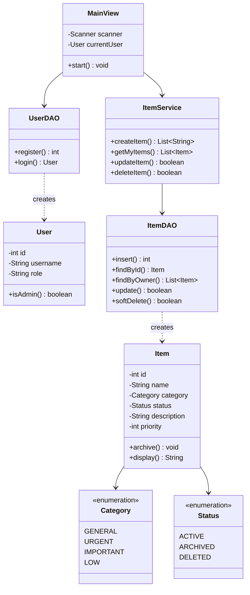
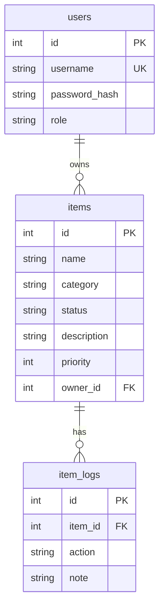

# BioBehaviorBridge (BBB)

## 📌 專案簡介
這是一個專為行為追蹤與生理數據量化設計的 Java 系統。
專案核心在於建立「行為」與「目標」之間的科學連結，特別針對戒斷恢復期設計。
透過自定義的角色天賦倍率（例如 1.15），將抽象的日常行為（冥想、重訓、飲食控制）轉化為具體的成長數據。

## 📊 技術架構 (ERD)
使用 Mermaid 繪製的資料庫關聯圖，展示了數據如何從使用者流向最終的行為紀錄：

```mermaid
erDiagram
    USERS ||--o{ GOALS : set
    GOALS ||--o{ CHARACTERS : assign
    GOALS ||--o{ BEHAVIOR_LOGS : record
    
    CHARACTERS {
        decimal bonus_decimal "天賦加成 (如 1.15)"
        string talent_type "天賦類型"
    }
    BEHAVIOR_LOGS {
        string action "行為類型"
        string note "備註 (如：握把深蹲 80kg)"
    }

## 🚀 如何使用

### 1. 建立資料庫

```bash
# 使用 psql 匯入定義的 1.15 倍率初始 Schema
psql -U postgres -d biobehaviorbridge -f sql/schema.sql

# 匯入資料表
psql -U postgres -h localhost -d myproject -f sql/schema.sql
```

### 2. 編譯 & 執行

```bash
# 執行 Main.java 啟動系統
java -cp ".;lib/*" com.linalingling.bbb.Main
```

### 3. 測試帳號

| 帳號 | 密碼 | 角色 |
|Lina|abc1234|USER|
| admin | admin | 管理者 |
| demo | demo | 一般使用者 |

## 📐 架構說明

```
View（畫面）  →  Service（邏輯）  →  DAO（資料庫）  →  PostgreSQL
  ↑ Scanner         ↑ 驗證/判斷         ↑ SQL/JDBC
  ↓ println         ↓ 回傳結果         ↓ 回傳 Model
```

### 各層職責

| 層 | 職責 | 可以做 | 不能做 |
|----|------|--------|--------|
| **View** | 使用者互動 | Scanner / println / 選單 | 寫 SQL |
| **Service** | 業務邏輯 | 驗證 / 計算 / 呼叫 DAO | 碰 Scanner |
| **DAO** | 資料存取 | SQL / JDBC / 回傳 Model | 業務判斷 |
| **Model** | 資料結構 | 屬性 / Getter / 業務方法 | 碰資料庫 |

## 📝 修改步驟（同學照做）

1. **改 package 名稱**：把 `com.template` 改成 `com.你的專題`
2. **改 Enum**：`Category` → 你的分類、`Status` → 你的狀態流程
3. **改 Model**：`Item` → 你的核心物件（例如 `Rose`、`Room`、`Bill`）
4. **改 SQL**：`schema.sql` 裡的 `items` 表改成你的資料表
5. **改 DAO**：`ItemDAO` 的 SQL 和 `mapRow()` 對應新欄位
6. **改 Service**：驗證規則改成你的業務需求
7. **改 View**：選單文字和操作流程

## 📊 類別圖（Mermaid）


```mermaid
classDiagram
    class User {
        -int id
        -String username
        -String role
        +isAdmin() boolean
    }
    class Item {
        -int id
        -String name
        -Category category
        -Status status
        -String description
        -int priority
        +archive() void
        +display() String
    }
    class Category {
        <<enumeration>>
        GENERAL
        URGENT
        IMPORTANT
        LOW
    }
    class Status {
        <<enumeration>>
        ACTIVE
        ARCHIVED
        DELETED
    }
    class UserDAO {
        +register() int
        +login() User
    }
    class ItemDAO {
        +insert() int
        +findById() Item
        +findByOwner() List~Item~
        +update() boolean
        +softDelete() boolean
    }
    class ItemService {
        +createItem() List~String~
        +getMyItems() List~Item~
        +updateItem() boolean
        +deleteItem() boolean
    }
    class MainView {
        -Scanner scanner
        -User currentUser
        +start() void
    }

    Item --> Category
    Item --> Status
    MainView --> ItemService
    ItemService --> ItemDAO
    MainView --> UserDAO
    ItemDAO ..> Item : creates
    UserDAO ..> User : creates
```

## 📊 ERD（Mermaid）


```mermaid
erDiagram
    users ||--o{ items : owns
    items ||--o{ item_logs : has

    users {
        int id PK
        string username UK
        string password_hash
        string role
    }
    items {
        int id PK
        string name
        string category
        string status
        string description
        int priority
        int owner_id FK
    }
    item_logs {
        int id PK
        int item_id FK
        string action
        string note
    }
```
